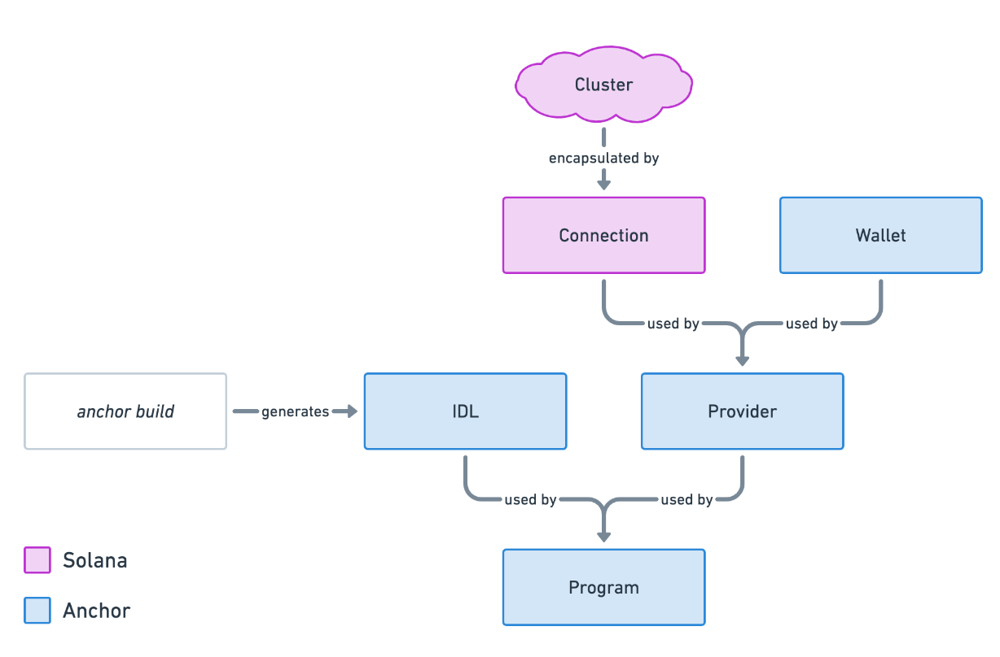

# Solana / Ethereum: Function Visibility


(*Photo : James Frid - [Pexels](https://www.pexels.com/fr-fr/photo/telescope-gris-et-or-sur-batiment-901974/)*)


## TL;DR

1. This article serves as a cheat sheet on the visibility of functions in Solana smart contracts.
2. A comparison will be made between Rust & Anchor on Solana and Solidity on Ethereum.
3. Smart contract functions define the behavior and actions of a contract on a blockchain.
3. Function visibility specifies their accessibility from within or outside a blockchain.

## Introduction

Smart contracts are an essential element of the blockchain ecosystem, providing decentralized and autonomous functionalities that underpin a wide range of applications.

In this article, we will explore **the visibility of functions in Rust on the Solana blockchain**, with the goal of helping those coming from Ethereum and familiar with Solidity better understand Solana.

While **Rust** is a very **powerful and general-purpose** language, perfectly suited for a wide variety of development tasks, **Solidity** is specific to writing **smart contracts** for EVM, notably on the Ethereum blockchain.

You can practice, test, and experiment with code using online "sandboxes":
- In **Solidity** using [**Remix**](https://remix.ethereum.org/), a platform for Ethereum smart contracts.
- For **Rust/Anchor**, you can use [**Playground**](https://beta.solpg.io/), an interface offering an environment to write and test Solana contracts.
- Additionally, for **Rust**, you can use [**Code Explorer**](https://godbolt.org/), specifically for this language by selecting it.

## Solidity

Smart contract functions in [**Solidity**](https://soliditylang.org/) are blocks of code that define the behavior and functionalities of a contract on the **Ethereum** blockchain.

Here are some key points to know about this:

- **Declaration**: Functions are declared within the contract using the `function` keyword.
- **Visibility**: Functions can have different levels of visibility, such as `external`, `public`, `private`, and `internal`, which determine how they can be called from within or outside the contract.
- **Mutability**: The mutability of a function is defined by the keywords `view` (*access to existing stored data without modification*) or `pure` (*no access or modification*).
- **Payability**: `payable` allows the function to receive payments during its execution.
- **Parameters**: Functions can accept parameters of different data types, such as integers, strings, arrays, etc.
- **Return Values**: Functions can also return values after their execution. You can specify the return value type using the `returns` keyword.
- **Modifiers**: Modifiers are reusable pieces of code that can modify the behavior of a function (*`modifier` keyword*). They are often used to add security conditions or pre-execution checks to the function.
- **Events**: Functions can emit events using the `emit` keyword. Events are useful for notifying external clients of the state or important actions performed by the contract.

### Visibility in Solidity

Here is a summary of the different visibility levels available for functions in **Solidity**:

- **External (`external`)**: External functions are similar to public functions, but they can only be called from outside the blockchain (*i.e., by other contracts or external transactions*). They cannot be called from within the contract that defines them.
- **Public (`public`)**: Public functions can be called from anywhere, both within the contract that defines them and from other contracts or outside the blockchain. They are typically used to define entry points for interacting with the contract.
- **Private (`private`)**: Private functions can only be called from other functions defined within the same contract. They are not accessible from outside the contract or from other contracts. They are typically used to encapsulate the internal logic of the contract and to avoid external interference.
- **Internal (`internal`)**: Internal functions are similar to private functions, but they can also be called from derived contracts (*inherited*). They are not accessible from outside the contract.

### Example in Solidity

```solidity
// SPDX-License-Identifier: GPL-3.0

pragma solidity >=0.8.2 <0.9.0;

// Contract A
contract ContractA {
    // Public state variable
    uint256 public publicVariable;

    // Private state variable
    uint256 private privateVariable;

    // Contract constructor
    constructor(uint256 _initialValue) {
        publicVariable = _initialValue;
        privateVariable = _initialValue;
    }

    // External function
    function externalFunction() external returns (uint256) {
        // Call to private function from a public function
        return privateFunction();
    }

    // Public function
    function publicFunction() public returns (uint256) {
        return publicVariable;
    }

    // Private function
    function privateFunction() private returns (uint256) {
        return privateVariable;
    }

    // Fonction interne
    function internalFunction() internal returns (uint256) {
        return privateVariable;
    }

}

// Inherited
contract Inherited is ContractA(42) {

//    // Public function calling a private function of contract A
//    function usePrivateFunctionContractA() public returns (uint256) {
//       // Call to private function of contract A
//        return privateFunction(); // Compilation error: privateFunction is not visible here
//    }

    // Public function calling an internal function of contract A
    function useInternalFunctionContractA() public returns (uint256) {
        // Call to internal function inherited from contract A
        return internalFunction();
    }

}
```

By choosing the appropriate visibility level for each function, developers can control how these functions are [**accessible**](assets/outside_contracts.png) (*Remix*) and [**usable**](assets/abi.json) (*ABI*), which contributes to the **security** and **clarity** of the contract.

## Rust & Anchor

With the Solana blockchain, smart contract functions are defined using the [**Rust**](https://www.rust-lang.org/) language and the [**Anchor**](https://www.anchor-lang.com/) framework, which simplifies the process of creating, deploying, and managing contracts for Solana.

Here are some key points to know:

- **Declaration**: Functions are defined inside a data structure defining the Solana smart contract and annotated with Anchor-specific attributes.
- **Specific Attributes**: Anchor provides several specific attributes for annotating functions in Solana contracts, such as `#[instruction]` for instructions, `#[state]` for states, and `#[derive(Accounts)]` for specifying the

 accounts needed to execute the function.
- **Instruction Functions**: Functions marked with the `#[instruction]` attribute are Solana contract instructions that can be called from outside the chain. They define the functionalities and actions of the contract.
- **Verification Functions**: Verification functions are used to validate transactions and can be marked with the `#[instruction]` attribute to indicate that they are called as instructions, or with the `#[guard]` attribute to indicate that they are used for validation only.
- **Account Management**: Anchor facilitates the management of accounts needed to execute functions using the `#[derive(Accounts)]` attribute, which specifies the accounts involved in a transaction and their role (*e.g., source account, destination account, contract state account, etc.*).

### Visibility with Rust & Anchor

#### External / Public

> The **distinction** between public and external **does not exist** with Anchor.

While this distinction exists with Solidity, it is tied to the definition made by the language itself and the compiler. It mainly serves to organize the code by limiting access via the `external` keyword.

In **Rust** with **Anchor**, a function is **public** by using the `pub` keyword, which makes it [**accessible**](https://doc.rust-lang.org/std/keyword.pub.html) from outside the module that defines it.

The `mod` is used to declare a module in Rust. A [**module**](https://doc.rust-lang.org/std/keyword.mod.html) is a grouping of elements for code structuring purposes.

The module (`mod`) must be "stamped" with the [**`#[program]` macro-attribute**](https://docs.rs/anchor-lang/latest/anchor_lang/attr.program.html) defined by the Anchor framework, allowing to define the module as a smart contract, with its functions becoming entry points for transactions on Solana.

**Illustration:**
```rust
// ...

#[program]
pub mod contract {
    use super::*;

    pub fn public_function(ctx: Context<Initialize>) -> Result<()> {
        // ...
        Ok(())
    }
}

// ...
```

#### Internal / Private

- Rust does not have a notion of "classes" like Solidity, as Rust is not an object-oriented language (*though an object approach is possible and compelling*).
- The distinction between "private" and "internal" cannot be directly applicable to Rust.

Modules help organize the code. [**Function visibility relative to modules**](https://doc.rust-lang.org/beta/reference/visibility-and-privacy.html) does exist, but we need to look at it differently in the Solana context.

> **Internal and private** are antagonistic visibilities to **external and public**.

They depend on two elements:
- Their links with the modules (`mod`)
- And whether the module is intended to be a contract (`#[program]`).

##### Private

The analogy to Solidity's `private` can be achieved by defining the function inside the contract module and ensuring it is **inaccessible from outside the module**.

```rust
// ...

#[program]
pub mod contract {
    use super::*;

    pub fn initialize(_ctx: Context<Initialize>) -> Result<()> {
        // ...
        private::private_function();
        // ...
        Ok(())
    }

    pub mod private {
        pub(in crate::contract) fn private_function() {
            // ...
        }
    }
}

mod other_module {
    use crate::contract;

    pub fn function() {
        // ...
        contract::private::private_function();
        // ...
    }
}

// ...
```

If we compile using the **`anchor build` command**, we will get the following error:

```bash
error[E0603]: function `private_function` is private
  --> programs/visibility/src/lib.rs:39:28
   |
39 |         contract::private::private_function();
   |                            ^^^^^^^^^^^^^^^^ private function
   |
note: the function `private_function` is defined here
  --> programs/visibility/src/lib.rs:26:9
   |
26 |         pub(in crate::contract) fn private_function() {
   |         ^^^^^^^^^^^^^^^^^^^^^^^^^^^^^^^^^^^^^^^^^^^^^
```

Which is exactly what we wanted.
- The `private_function()` function is indeed **inaccessible** during compilation, as it is outside the module.
- The compiler considers it **private**.

##### Internal

To achieve an equivalent of Solidity's `internal`, you simply define the function inside the contract module and make it accessible both inside and outside that module.

```rust
// ...

#[program]
pub mod contract {
    use super::*;

    pub fn initialize(_ctx: Context<Initialize>) -> Result<()> {
        // ...
        internal::internal_function();
        // ...
        Ok(())
    }

    pub mod internal {
        pub fn internal_function() {
            // ...
        }
    }
}

mod other_module {
    use crate::contract;

    pub fn function() {
        // ...
        contract::internal::internal_function();
        // ...
    }
}

// ...
```

### Example with Rust & Anchor

The program below summarizes the attainment of visibility using **Rust and Anchor**. It attempts to replicate the visibility concepts from Solidity (*see previous example*).

```rust
use anchor_lang::prelude::*;

declare_id!("5gxeL3AFd6utfoUjuRxRHyFbujXEZuUdFonBXNwaas64");
// The `declare_id!` macro in the Anchor framework is used to declare
// and automatically generate a unique identifier for a program.

#[program]
pub mod contract {
    use super::*;

    pub fn initialize(ctx: Context<Initialize>) -> Result<()> {
        internal::internal_function();
        private::private_function();
        Ok(())
    }

    pub fn public_function(ctx: Context<Initialize>) -> Result<()> {
        // ...
        Ok(())
    }

    pub mod internal {
        pub fn internal_function() {
            // ...
        }
    }

    pub mod private {
        pub(in crate::contract) fn private_function() {
            // ...
        }
    }

}

mod other_module {
    use crate::contract;

    pub fn function() {
        // ...
        contract::internal::internal_function();
        //contract::private::private_function();
        // error[E0603]: function `private_function` is private
        // ...
    }
}

#[derive(Accounts)]
pub struct Initialize {}
```

With Anchor, we find the equivalent of Solidity's **ABI** data, which exposes the entry points between a Solana smart contract and client applications. These are the [**IDL** (*Interface Description Language*)](https://en.wikipedia.org/wiki/Interface_description_language) data.

They specify the structure of data and available functions, facilitating interaction and communication between smart contracts and external applications. This data in [**JSON**](https://www.json.org/json-en.html) format is generated during the Solana project build.


(*Source: [SolDev - Intro to client-side Anchor development](https://www.soldev.app/course/intro-to-anchor-frontend)*)

File: "*contract.json*"
```json
{
  "version": "0.1.0",
  "name": "contract",
  "instructions": [
    {
      "name": "initialize",
      "accounts": [],
      "args": []
    },
    {
      "name": "publicFunction",
      "accounts": [],
      "args": []
    }
  ]
}
```

**Note:** Function and project names follow Rust's naming convention, **snake_case**, but these are "*transformed*" into [**lowerCamelCase**](https://www.techtarget.com/whatis/definition/lowerCamelCase) in the **IDL** data and in the **TypeScript** code used for client-side unit testing.

`public_function` ➔ `publicFunction`

## Conclusion

Let's draw a parallel between object languages and smart contracts:
- In **object languages**, access modifiers allow for controlling encapsulation of data and functionalities within classes, thus promoting code modularity, security, and reusability.
- In the context of **smart contracts** - especially on Ethereum and Solana - visibilities define who can access different parts of the contract's code, establishing clear interfaces for interactions.

> Due to certain design and architectural differences of Solana and the specificities of Rust compared to Ethereum and Solidity, these concepts from Ethereum cannot be directly transposed to Solana.

In summary, if we want to try to translate **Solidity visibilities to Rust/Anchor**:
- **Public / External**: Accessible everywhere. By default, all functions declared with `pub` in a `#[program]` module are public.
- **Internal**: Accessible only inside the program and its child modules. Functions within a `pub mod` block are not accessible from the outside but remain reachable in our code.
- **Private**: Not accessible from outside. For a private function in Rust/Solana, declaring it in a module with `pub(in crate::contract)` makes it visible exclusively within its module.

The use of [**specific macros**](https://doc.rust-lang.org/book/ch19-06-macros.html) could greatly simplify the assignment and usage of visibility to Rust/Anchor functions more closely to that of Solidity. But is it really useful to mimic Solidity to such an extent? It might be wiser to immerse oneself in the specific paradigm of Solana.

## Side Notes:

Rust is not the only language that allows creating smart contracts on the Solana blockchain. The [**Seahorse**](https://seahorse-lang.org/) framework, for example, allows programming them in [**Python**](https://www.python.org/). Seahorse relies on Anchor as well as various other Rust crates to function.

There is also the [**Solang**](https://solana.com/developers/guides/solang/getting-started) project, which is a **Solidity compiler** for Solana and [**Polkadot**](https://substrate.io/), thus expanding the development possibilities. Like Seahorse, Solang relies on Anchor to function.

It uses the software environment of the [**LLVM**](https://www.llvm.org/) project to produce [**WebAssembly (WASM)**](https://webassembly.org/) or **Solana Binary format (SBF)** code. It aims for source compatibility with version 0.8 of the `solc` compiler; however, a good understanding of both blockchains is required to master it correctly, and specific adjustments sometimes need to be made in the Solidity code.

--------

Credits: **[Franck Maussand](mailto:franck@maussand.net)**

Feel free to check out my previous articles on [**Medium**](https://medium.com/@franck.maussand) (🇫🇷 **/** 🇬🇧)!

*Thanks to [**Igor Bournazel**](https://github.com/ibourn) for his suggestions and proofreading of this article.*

--------


## Additional Resources

- **Blockchains :**
  - [Home | ethereum.org](https://ethereum.org)
  - [Web3 Infrastructure for Everyone | Solana](https://solana.com/)

- **Solidity :**
  - [Home | Solidity Programming Language](https://soliditylang.org/)
  - [Solidity - Wikipedia](https://en.wikipedia.org/wiki/Solidity)

- **Rust :**
  - [Rust (programming language) - Wikipedia](https://en.wikipedia.org/wiki/Rust_(programming_language))
  - [Rust Programming Language](https://www.rust-lang.org/)
  - [Visibility and privacy - The Rust Reference](https://doc.rust-lang.org/beta/reference/visibility-and-privacy.html)
  - [pub - Rust](https://doc.rust-lang.org/std/keyword.pub.html)
  - [mod - Rust](https://doc.rust-lang.org/std/keyword.mod.html)
  - [Macros - The Rust Programming Language](https://doc.rust-lang.org/book/ch19-06-macros.html)

- **Anchor :**
  - [Anchor - Introduction](https://www.anchor-lang.com/)
  - [Anchor By Example - Introduction](https://examples.anchor-lang.com/)
  - [program in anchor_lang - Rust](https://docs.rs/anchor-lang/latest/anchor_lang/attr.program.html)
  - [Visibility and "inheritance" in Rust and Solana](https://www.rareskills.io/post/rust-function-visibility)
  - [GitHub - coral-xyz/anchor: ⚓ Solana Sealevel Framework](https://github.com/coral-xyz/anchor)

- **IDL :**
  - [Interface description language - Wikipedia](https://en.wikipedia.org/wiki/Interface_description_language)
  - [What is an IDL?](https://www.quicknode.com/guides/solana-development/anchor/what-is-an-idl)
  - [SolDev - Intro to client-side Anchor development](https://www.soldev.app/course/intro-to-anchor-frontend)

- **Seahorse :**
  - [Seahorse (Beta) | Solana programs in Python](https://seahorse-lang.org/)
  - [Solana Bytes - Intro to Seahorse - YouTube](https://www.youtube.com/watch?v=Wt3kcIb98Do)

- **Solang :**
  - [Getting started with Solang | Solana](https://solana.com/developers/guides/solang/getting-started)
  - [Solang Solidity Compiler — Solang Solidity Compiler documentation (latest)](https://solang.readthedocs.io/en/latest/)
  - [The LLVM Compiler Infrastructure Project](https://www.llvm.org/)

- **Sandbox :**
  - [Remix - Ethereum IDE](https://remix.ethereum.org/)
  - [Solana Playground | Solana IDE](https://beta.solpg.io/)
  - [Compiler Explorer (for Rust 🦀)](https://godbolt.org/)

- **Naming convention :**
  - [Snake case - Wikipedia](https://en.wikipedia.org/wiki/Snake_case)
  - [Camel case - Wikipedia](https://en.wikipedia.org/wiki/Camel_case)
  - [What is the lowerCamelCase naming convention?](https://www.techtarget.com/whatis/definition/lowerCamelCase)